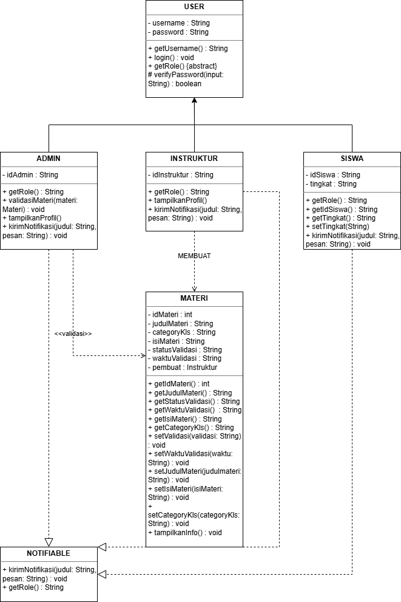

# Quality Education — OOP Project

Quality Education adalah aplikasi manajemen pembelajaran berbasis Java yang berjalan di konsol (terminal). Aplikasi ini mensimulasikan sistem interaksi antara Admin, Instruktur, dan Siswa dalam proses pembelajaran digital.

Project ini dibangun sebagai Tugas Akhir Mata Kuliah Pemrograman Berorientasi Objek (PBO) dengan menerapkan konsep OOP secara menyeluruh, meliputi Abstract Class, Inheritance, Interface, Encapsulation, dan Polymorphism.

---

## Anggota Kelompok

| Nama | NIM | Role |
|------|-----|------|
| Alfia Nur Ismawati | 254311005 | Role 1 + Role 4 |
| Indah Ayu Astuti | 254311002 | Role 2 + Role 4 |
| Sekar Purwita Asri | 254311008 | Role 3 + Role 4 |

### Alfia Nur Ismawati — 254311005

**Role 1 : Class Architect**
- Merancang hierarki class keseluruhan
- Membuat `User.java` sebagai abstract class induk
- Membuat `Notifiable.java` sebagai interface
- Membuat `Admin.java`, `Instruktur.java`, `Siswa.java` yang extends `User`
- Membuat `Materi.java` sebagai class entitas pembelajaran
- Memastikan semua field menggunakan encapsulation (private + getter/setter)
- Memastikan semua subclass mengimplementasikan abstract method `getRole()`
- Membuat dan memperbarui `class-diagram.png`

**Role 4 : Git Master**
- Membuat dan mengelola repository GitHub
- Mengatur struktur branch untuk tiap anggota
- Melakukan review dan merge Pull Request dari semua anggota
- Menjaga branch `main` tetap bersih dan stabil
- Membuat README.md teknis project

---

### Indah Ayu Astuti — 254311002

**Role 2 : Data & Logic Engineer**
- Mengimplementasikan `ArrayList` untuk menyimpan data Admin, Instruktur, Siswa, dan Materi di memori
- Membuat `DataManager.java` berisi logika CRUD:
  - `tambahData()` — menambahkan objek ke list
  - `lihatSemuaData()` — menampilkan seluruh isi list
  - `cariData()` — mencari objek berdasarkan ID
  - `hapusData()` — menghapus objek dari list
  - `updateData()` — memperbarui data objek
- Memastikan operasi list berjalan benar tanpa error

**Role 4 : Menulis JUnit Test**
- Membuat `QualityEducationTest.java`
- Menulis test case untuk setiap method CRUD di `DataManager`
- Menulis test case untuk memverifikasi inheritance dan polymorphism
- Memastikan semua test lolos sebelum merge ke `main`

---

### Sekar Purwita Asri — 254311008

**Role 3 : UI & Robustness Engineer**
- Membuat `Main.java` sebagai entry point aplikasi
- Membuat menu interaksi berbasis konsol menggunakan `Scanner`
- Membuat menu bertingkat: menu utama → menu per role (Admin/Instruktur/Siswa)
- Mengimplementasikan `try-catch` pada setiap input pengguna agar program tidak crash
- Memvalidasi input: angka tidak boleh huruf, field tidak boleh kosong
- Memastikan program berjalan stabil dari awal hingga keluar

**Role 4 : Menyusun Dokumentasi**
- Mendokumentasikan setiap class dan method dengan komentar Javadoc
- Merapikan format kode agar konsisten di semua file
- Menyiapkan bahan presentasi atau demo project

---

## Prasyarat

Pastikan perangkat sudah terinstall sebelum menjalankan project:

| Kebutuhan | Versi Minimum |
|-----------|--------------|
| Java JDK | 17+ |
| Git | 2.x+ |
| IDE (opsional) | IntelliJ IDEA / VS Code |

Verifikasi instalasi:

```bash
java -version
javac -version
git --version
```

---

## Instalasi & Setup

```bash
# 1. Clone repository ke komputer lokal
git clone https://github.com/Alfialsmawatii30/Quality-Education_Project-OOP.git

# 2. Masuk ke folder project
cd Quality-Education_Project-OOP

# 3. Compile semua file Java sekaligus
javac *.java
```

Jika tidak ada pesan error setelah `javac *.java`, berarti kompilasi berhasil.

---

## Cara Menjalankan Program

```bash
java Main
```

Tampilan awal program:

```
========================================
       QUALITY EDUCATION SYSTEM
========================================
1. Login sebagai Admin
2. Login sebagai Instruktur
3. Login sebagai Siswa
4. Keluar
Pilih menu: _
```

Contoh alur penggunaan:

```
Pilih menu: 1
Masukkan username: admin01
Masukkan password: pass123
admin01 berhasil login sebagai Admin Sistem.

=== MENU ADMIN ===
1. Tambah Instruktur
2. Tambah Siswa
3. Lihat Semua Materi
4. Validasi Materi
5. Logout
Pilih: _
```

---

## Cara Menjalankan JUnit Test

```bash
# 1. Compile file test beserta dependensi JUnit
javac -cp .:junit-platform-console-standalone.jar *.java

# 2. Jalankan test
java -cp .:junit-platform-console-standalone.jar org.junit.runner.JUnitCore QualityEducationTest
```

Contoh output jika semua test lolos:

```
JUnit version 4.x
.......
Time: 0.045
OK (7 tests)
```

---

## Struktur Project

```
Quality-Education_Project-OOP/
│
├── User.java                    ← Abstract class induk (Role 1 - Alfia)
├── Notifiable.java              ← Interface notifikasi (Role 1 - Alfia)
├── Admin.java                   ← Subclass Admin extends User (Role 1 - Alfia)
├── Instruktur.java              ← Subclass Instruktur extends User (Role 1 - Alfia)
├── Siswa.java                   ← Subclass Siswa extends User (Role 1 - Alfia)
├── Materi.java                  ← Class entitas materi (Role 1 - Alfia)
│
├── DataManager.java             ← ArrayList + logika CRUD (Role 2 - Ayu)
├── QualityEducationTest.java    ← JUnit Test (Role 4 - Ayu)
│
├── Main.java                    ← Menu + Scanner + try-catch (Role 3 - Sekar)
│
├── class-diagram.png            ← Diagram UML class
└── README.md                    ← Dokumentasi project ini
```

---

## Konsep OOP yang Diterapkan

| Konsep | Implementasi |
|--------|-------------|
| Abstract Class | `User` tidak bisa diinstansiasi langsung, memiliki method abstract `getRole()` |
| Inheritance | `Admin`, `Instruktur`, `Siswa` extends `User` dan mewarisi semua field serta method-nya |
| Interface | `Notifiable` diimplementasikan oleh ketiga subclass, mewajibkan `kirimNotifikasi()` |
| Encapsulation | Semua field `private`, akses hanya lewat getter dan setter |
| Polymorphism | `getRole()` di-override berbeda di tiap subclass, `login()` memanggil `getRole()` secara polimorfik |

---

## Class Diagram



---

## Refactoring yang Dilakukan

| Teknik | Sebelum | Sesudah |
|--------|---------|---------|
| Extract Method | Satu method panjang 80+ baris | Dipecah: `tampilkanProfil()`, `validasiMateri()`, `kirimNotifikasi()` |
| Rename Variable | `String d`, `int x`, `String s` | `String idAdmin`, `int idMateri`, `String statusValidasi` |
| Remove Duplicate | Logika cek password tersebar di tiap subclass | Dipusatkan di `User.verifyPassword()` |
| Encapsulation Fix | Field `public String username` | Diubah ke `private` + getter/setter |
| Interface Segregation | `getRole()` dobel di interface dan abstract class | `getRole()` hanya di abstract `User`, interface hanya berisi `kirimNotifikasi()` |

---

## Branch Strategy

| Branch | Penanggung Jawab | Isi |
|--------|-----------------|-----|
| `main` | Semua (via Pull Request) | Kode final yang sudah direview |
| `feature/role1-abstract-oop` | Alfia | Abstract class, interface, semua subclass |
| `feature/role1-update-siswa` | Alfia | Perbaikan dan penambahan atribut Siswa |
| `feature/role-2` | Ayu | DataManager ArrayList + CRUD + JUnit Test |
| `feature/role-3` | Sekar | Main.java + Scanner + try-catch |

---

## Contributing

Pull request sangat diterima. Untuk perubahan besar, buka Issue terlebih dahulu untuk mendiskusikan apa yang ingin diubah. Pastikan test sudah diperbarui sesuai perubahan.

```bash
# 1. Pastikan branch lokal up to date
git checkout main
git pull origin main

# 2. Pindah ke branch fitur
git checkout feature/nama-branch

# 3. Kerjakan, lalu commit
git add .
git commit -m "feat: deskripsi perubahan"
git push origin feature/nama-branch

# 4. Buat Pull Request di GitHub
#    base: main  ←  compare: feature/nama-branch
#    minta review dari Git Master (Alfia) sebelum merge
```

Format pesan commit:

```
feat:      fitur baru
fix:       perbaikan bug
refactor:  ubah kode tanpa ubah fungsi
docs:      update dokumentasi
test:      tambah atau perbaiki test
```

---

*Tugas Akhir Mata Kuliah Pemrograman Berorientasi Objek*  
*Program Studi Teknologi Rekayasa Perangkat Lunak — Politeknik Negeri Madiun 2026*